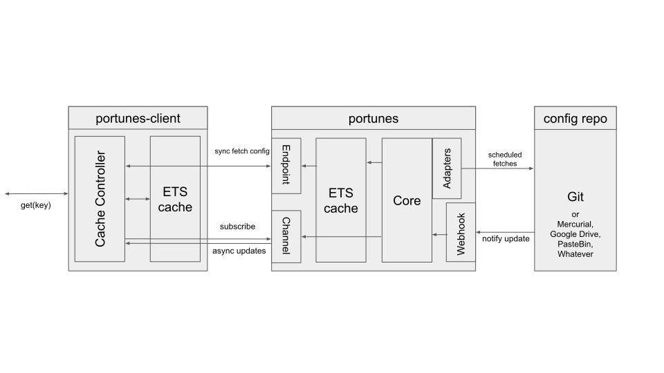

# Portunes
An Elixir Config Server inspired by Spring Boot's own config server

# Rationale
Many developers agree that a service and it's production configuration should remain in different repositories and be injected at runtime. The easiest way tends to be via ENV_VARS that the service will read when booting up. 

This is not a problem unless you intend to put the service inside a container, build and image and deploy that image. Best case you set the env vars externally and the service knows to read them during runtime. But what happens when you want to change this config? Ideally you have this config in another repo, so you trigger a webhook or run a pipeline with every new comit, but there is no way to externally modify the env of a running container without restarting it. Worse, in many cases you might even have to rebuild the image because the environment is set during the build phase.

On the other hand elixir almost forces your services to be stateless, so having the configuration being updated while the service is running is way less dangerous than with statefull services (you should be carefull if using stateful processes ofc) so having a central repository of configuration that can be updated at any time is very convenient and relatively safe.

The question of the performance and the number of calls can be mitigated by employing another Elixir (well, Erlang) tool: the ETS tables. No need to add external dependencies such a redis cache when every Erlang virtual machine already ships with a cache that serves our neeeds.

By caching both client and server we can ensure that no time in wasted in HTTP calls or reading an actual file in the file system or worse synchronously fetching commits from a Git config repo.

The last element of this config server/client pair is having a way for the server itself to push config updates, which can easily be achieved by using Phoenix Websockets.

# Architecture

